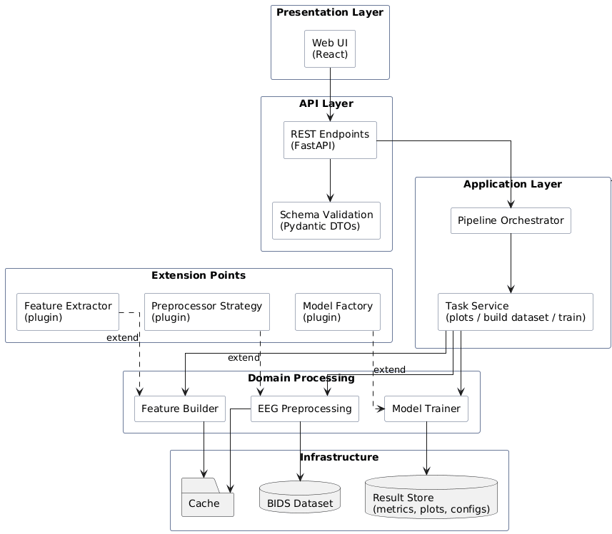
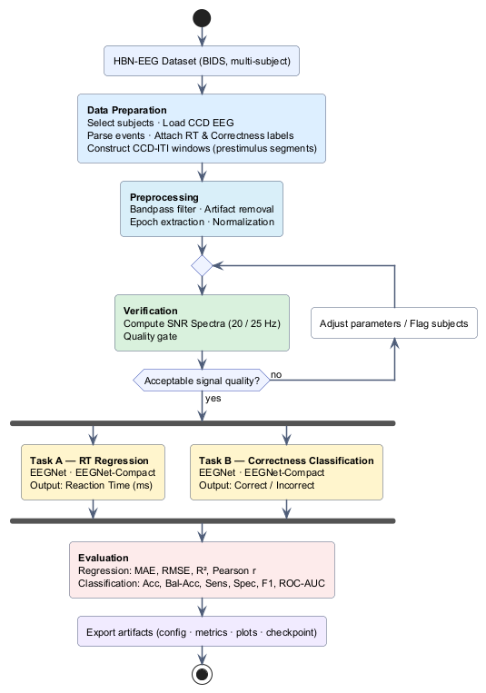
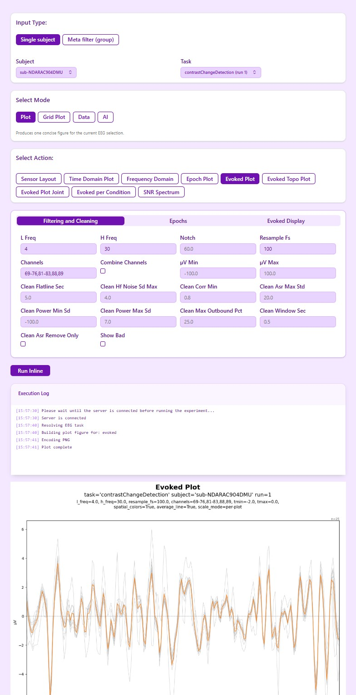
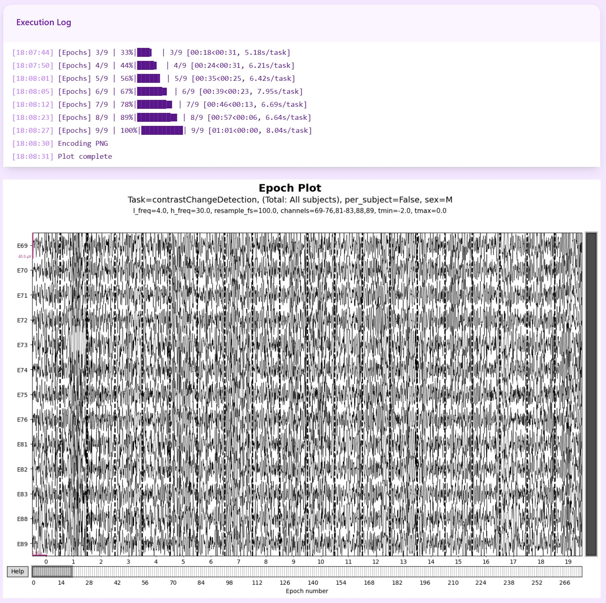

# EEG Analysis Platform for Prestimulus EEG-Based Behavioral Prediction

An interactive, reproducible EEG analysis platform for exploring brain signals and building machine learning models to predict behavioral outcomes from prestimulus EEG data.

Developed as a Software Engineering project at Kasetsart University in collaboration with BRAIN-Interfaces Lab (VISTEC).

---

## 🧠 Overview

EEG research workflows are often fragmented across notebooks, making them difficult to reproduce, compare, and scale.

This project proposes a unified platform that:

- Integrates EEG preprocessing, visualization, and machine learning
- Supports prestimulus EEG-based behavioral prediction
- Enables reproducible, parameter-driven experimentation
- Reduces reliance on ad-hoc notebook pipelines

The system is designed for both **researchers** and **students** working with EEG data, especially in multi-subject datasets.

---

## 🎯 Objectives

- Build a unified EEG analysis platform
- Enable modeling of prestimulus EEG signals (CCD task)
- Support:
  - Reaction Time prediction (regression)
  - Trial correctness prediction (classification)
- Improve reproducibility and efficiency of EEG workflows

---

## 🧱 System Architecture

The platform follows a **client–server architecture**:

- **Frontend**: React (UI for interaction and visualization)
- **Backend**: FastAPI (API + processing engine)
- **Pipeline**: Modular EEG processing workflow
- **AI Module**: Model training and evaluation



### Core Flow

Web UI → FastAPI → EEG Pipeline → Model Training → Results

### Backend Structure

app/
├── api/ # FastAPI endpoints
├── pipeline/ # EEG processing pipeline
├── core/ # config, caching, session management
├── ai_models/ # ML/DL models (EEGNet, CNN-LSTM, etc.)
├── plots/ # visualization modules
├── schemas/ # parameter & request schemas

---

## 🔬 Data & Study Setup

- **Dataset**: Healthy Brain Network EEG (HBN-EEG)
- **Task**: Contrast Change Detection (CCD)
- **Focus**: Prestimulus (ITI) EEG signals

Download dataset:
👉 https://neuromechanist.github.io/data/hbn/

Related resources:
- MixNet: https://mixnetbci.github.io/
- EEG Challenge: https://eeg2025.github.io/data/

> ⚠️ Note: Dataset is not included. You must download and configure it locally.

---

## ⚙️ Getting Started

### 1. Clone repository

```bash
git clone https://github.com/Nantawat6510545543/EEGAnalysis-Platform-for-Prestimulus-EEG-Based-Behavioral-Prediction.git
cd backend
```

### 2. Configure environment
```bash
cp sample.env .env
```
Update .env:

DATA_ROOT=/path/to/HBN-EEG
BACKEND_URL=http://localhost:8000
FRONTEND_URL=http://localhost:3000

### 3. Run with Docker
```bash
docker-compose up --build
```

For the first build, it might take at least 40 minutes or more to install.

After running, the backend will be available at: http://localhost:8000

---

## 📡 API Documentation
This project uses FastAPI’s built-in interactive docs.

To see, visit: http://localhost:8000/docs

---

## 🔁 Typical Workflow

The platform follows a structured research workflow:



### 1. Data Selection
- Choose a subject or define a cohort
- Select Contrast Change Detection (CCD) task data

### 2. Signal Inspection
- Visualize EEG signals:
  - Time domain
  - Frequency domain
  - Signal-to-noise ratio (SNR)
- Verify data quality and event alignment

### 3. Preprocessing
- Apply filtering and cleaning steps
- Normalize signals
- Configure parameters explicitly to ensure reproducibility

### 4. Epoch Construction
- Extract prestimulus (inter-trial interval) EEG segments
- Align EEG segments with behavioral labels:
  - Reaction Time (RT)
  - Trial correctness

### 5. Dataset Building
- Construct datasets for:
  - Traditional ML (feature-based)
  - Deep Learning (tensor-based)

### 6. Model Training
- Train models such as EEGNet
- Support multiple architectures (CNN, CNN-LSTM, etc.)
- Use appropriate data splits (e.g., subject-aware if applicable)

### 7. Evaluation
- Regression metrics:
  - MAE, RMSE, R²
- Classification metrics:
  - Accuracy, Precision, Recall, F1-score

### 8. Visualization & Analysis
- Generate plots and tables
- Compare different runs and parameter configurations
- Interpret model behavior and results

---

## 🤖 Machine Learning Component

The platform supports both regression and classification tasks based on prestimulus EEG signals.

### Regression Task
- Predict **Reaction Time (RT)** from EEG data

### Classification Task
- Predict **Trial Correctness** (correct vs. incorrect response)

### Supported Models
- EEGNet (primary model for EEG data)
- CNN-LSTM hybrid models
- Simple neural networks (baseline)

---

## 📊 Key Findings

From experimental results:

- **Reaction Time Prediction**
  - Weak predictive performance (low R²)
  - Models tend to regress toward the mean

- **Correctness Prediction**
  - Performance affected by class imbalance
  - Improvements observed when balancing training data

- **Insight**
  - Prestimulus EEG signals contain behavioral information
  - However, stronger models and richer features are needed for reliable prediction

---

## 🔁 Reproducibility Features

The platform is designed to ensure experiments can be reliably reproduced:

- Parameter-driven pipeline configuration
- Cached intermediate processing steps
- Job-based result storage (models, metadata)
- Explicit dataset and model settings

Each experiment can be re-run using saved configurations.

---

## 🚀 Features

- Interactive EEG visualization
- Cohort-based analysis across subjects
- Modular and extensible processing pipeline
- Integrated machine learning workflows
- Fast iteration through caching mechanisms

---

## 📊 Example Output



The platform provides built-in visualization tools for inspecting EEG signals,
analyzing frequency components, and interpreting model outputs.

---

## 🔮 Future Work

### Platform & Usability
- Improve usability with tutorials and guided workflows
- Collect user feedback to refine interface design
- Enhance plugin system for easier extension

### Modeling
- Address class imbalance more effectively
- Improve regression performance
- Incorporate richer EEG features:
  - Frequency-domain features
  - Brain connectivity metrics

---

## 👨‍💻 Authors

- Naytitorn Chaovirachot  
- Nantawat Suksirisunt  

**Advisor:**
- Asst. Prof. Dr. Thanawin Rakthanmanon  

**Collaboration:**
- BRAIN-Interfaces Lab, VISTEC

---

## 📌 Notes

This project is intended for research and experimentation purposes.

It is not designed for clinical or medical use. Model outputs should be interpreted as exploratory insights rather than definitive predictions.